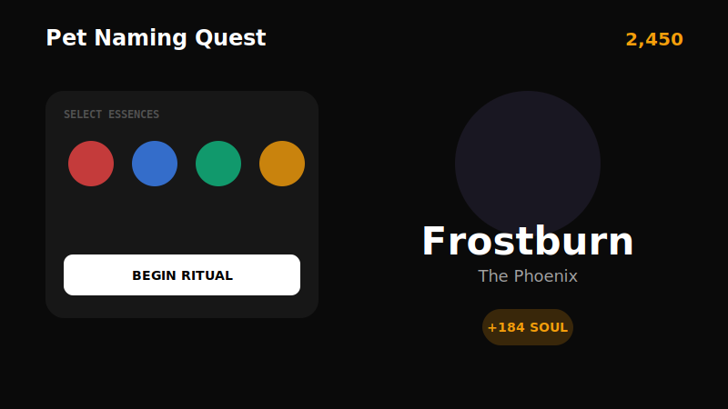

<p align="center">
  
</p>

<h1 align="center">✨ Pet Naming Quest ✨</h1>

<p align="center">
  <b>Become the Ultimate Master Namer in this Alchemical Pet Synthesis Game!</b>
</p>

<p align="center">
  
  
  
</p>

---

<p align="center">
  
</p>

## 🧪 The Alchemist's Tale

In a world where pets are born from pure intention and cosmic energy, you are the **Master Namer**. Your task is to combine ancient **Essences** to breathe life into mysterious beings. But beware—not all combinations are equal! Only the most skilled Alchemists can reach the rank of *Transcendental Master*.

## 🎮 How to Play

1.  **Select Your Essences**: Choose two powerful essences from your collection (Shadow, Star, Chaos, Fire, and more).
2.  **Perform the Ritual**: Click "Begin Ritual" to initiate the synthesis. Watch as the energies collide!
3.  **Discover Your Pet**: A unique name is born! Will it be a *Nova-glow Phoenix* or a *Gloom-void Slime*?
4.  **Harness Soul Power**: Each discovery grants you **Soul Power**. Accumulate power to level up your Namer Rank.
5.  **Build Your Chronicle**: Every pet you name is recorded in the *Chronicle of Names*. Can you find all the legendary combinations?

## 🚀 Quick Start

Get your alchemy lab running in seconds:

```bash
# Install dependencies
npm install

# Start the lab (development server)
npm run dev
```

Open [http://localhost:5173](http://localhost:5173) in your browser and start your quest!

## 🛠 Tech Stack

- **Svelte 5**: Utilizing the latest **Runes** for lightning-fast state management.
- **Tailwind CSS 4**: Modern, utility-first styling for a sleek, dark-mode aesthetic.
- **Lucide Svelte**: Beautiful, consistent iconography.
- **Vite**: Ultra-fast build tool for a smooth developer experience.

## 🏆 Ranks

Can you climb the ladder?
- 🥚 **Novice Namer** (0+ Soul)
- 🧪 **Apprentice Alchemist** (100+ Soul)
- 📜 **Pet Sage** (500+ Soul)
- 🔮 **Soul Weaver** (1,500+ Soul)
- 👑 **Transcendental Master** (5,000+ Soul)

---

<p align="center">
  Made with ✨ by the Gemini CLI Alchemist
</p>
